# Comparative Analysis of Reinforcement Learning Algorithms on MiniGrid

This repository presents an implementation and comparison of classical
tabular reinforcement learning algorithms on the MiniGrid environment as
part of the IvLabs Summer Internship selection task.

The goal is to study and compare the learning behavior of different RL
algorithms in a discrete state–action space.

---

## Algorithms Implemented

- Monte Carlo Control (Every-Visit, ε-greedy)
- Q-learning (off-policy temporal difference control)
- SARSA(λ) (on-policy temporal difference control with eligibility traces)
- TD(λ) / SARSA(λ) (on-policy temporal difference control with eligibility traces)

Each algorithm learns an optimal policy for navigating MiniGrid environments
using a Q-table representation.

---

## Environment

- MiniGrid (Gymnasium)  
- Discrete observation and action space  
- Sparse reward setting  

---

## Results

Training performance was evaluated using episode reward curves.

### Monte Carlo Control


### Q-learning


### SARSA(λ)


---

## Q-learning Decay Strategy Comparison

To analyze the effect of different exploration decay strategies on
Q-learning, experiments were conducted using multiple epsilon decay
schedules.

| Decay Strategy | Graph | Interpretation |
|----------------|----------------|----------------|
| **Linear decay** | 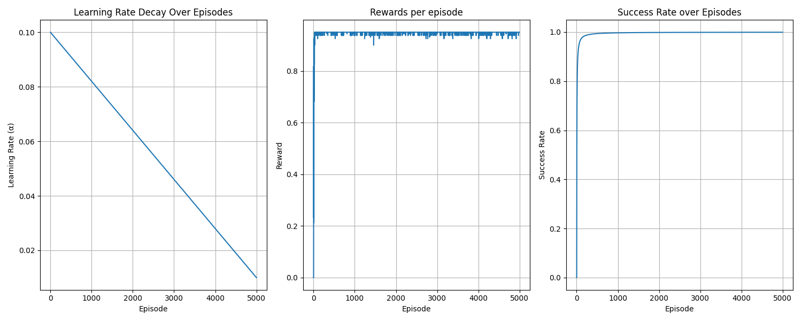 | Gradual reduction in exploration enables steady learning and smoother convergence while balancing exploration and exploitation. |
| **Inverse time decay** | 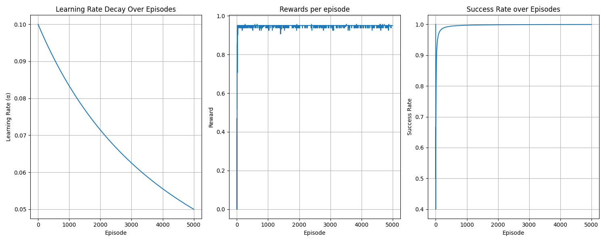 | Maintains exploration for a longer duration, often resulting in more stable long-term performance at the cost of slower early convergence. |

### Q-learning Observations

- Off-policy updates allow faster learning toward optimal actions.  
- Aggressive decay can amplify maximization bias.  
- Moderate decay schedules provide the best tradeoff between speed and stability.  

---

## SARSA(λ) Decay Strategy Comparison

To understand how different exploration decay strategies influence SARSA(λ), reward curves were analyzed under multiple epsilon decay schedules.

| Decay Strategy | Curve Variant 1 | Curve Variant 2 | Interpretation |
|----------------|----------------|----------------|----------------|
| **Linear decay** | 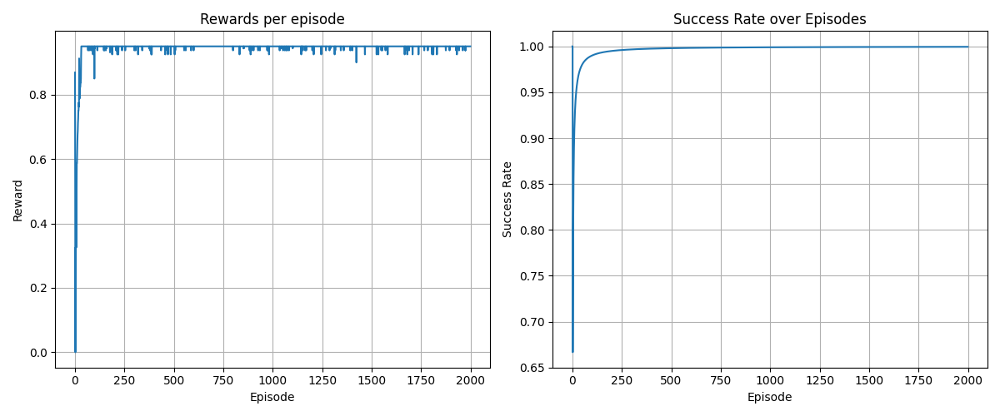 |  | Produces smooth and stable convergence by gradually shifting from exploration to exploitation. |
| **Exponential decay** | 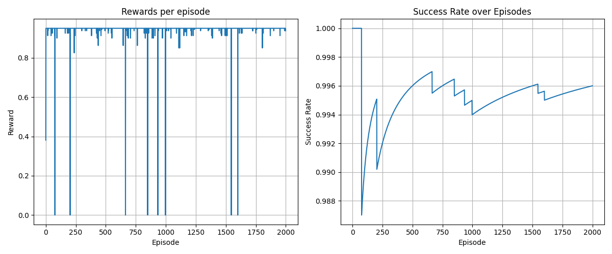 |  | Accelerates convergence but may reduce policy robustness if exploration decays too quickly. |
| **Inverse time decay** | 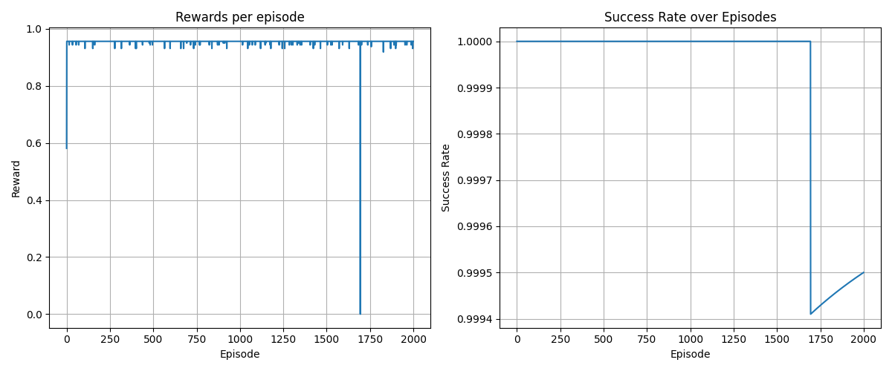 |  | Sustains exploration longer, often resulting in stable learning and improved long-term performance. |

### SARSA(λ) Observations

- On-policy learning benefits from slower decay schedules.  
- Eligibility traces help assign credit across state–action sequences.  
- Stability is generally higher compared to Q-learning.  

---

## TD(λ) Decay Strategy Comparison

To study the effect of different exploration decay strategies on TD(λ) / SARSA(λ), experiments were conducted under multiple epsilon decay schedules.

| Decay Strategy | Curve Variant 1 | Curve Variant 2 | Interpretation |
|----------------|----------------|----------------|----------------|
| **Linear decay** | 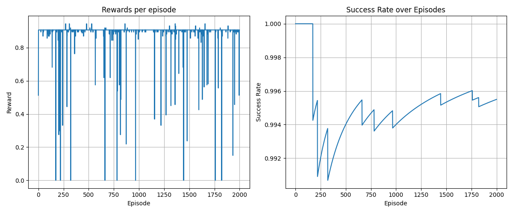 | 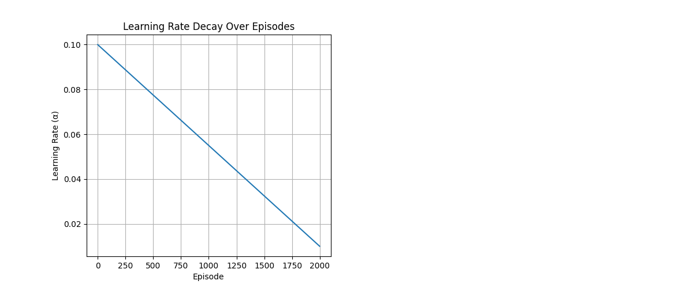 | Gradual reduction in exploration leads to smooth and stable learning, balancing exploration and exploitation. |
| **Exponential decay** | 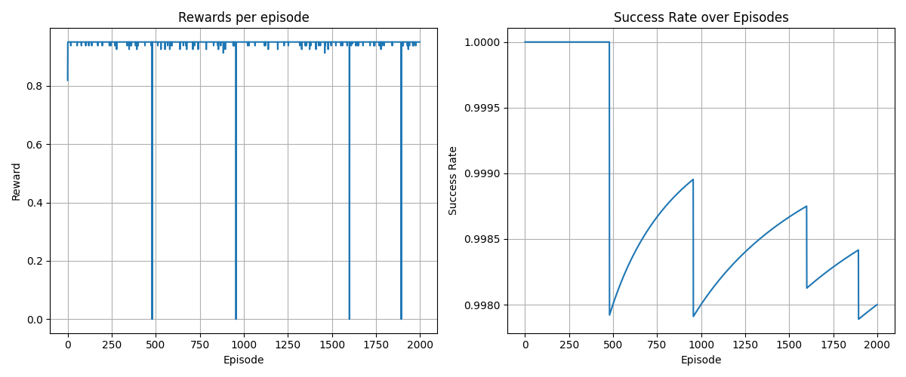 | 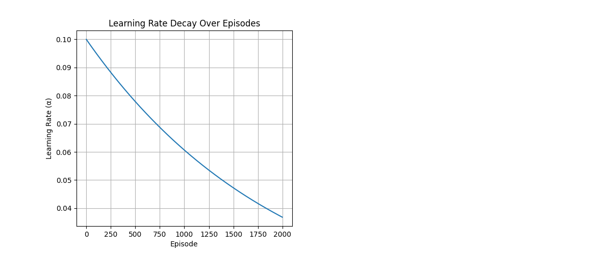 | Faster convergence but may reduce policy robustness if exploration decays too quickly. |
| **Inverse time decay** | 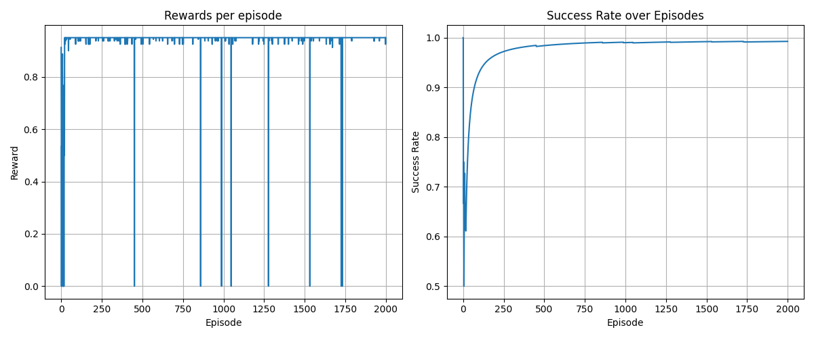 | 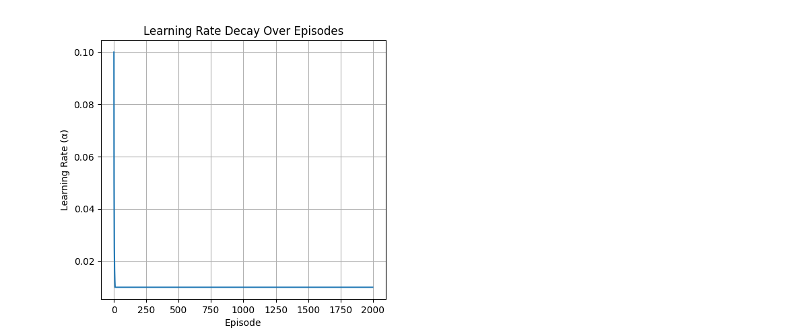 | Maintains exploration for longer durations, resulting in more stable long-term performance. |

### TD(λ) Observations

- Eligibility traces allow faster credit assignment across state–action sequences.  
- On-policy updates help achieve smoother convergence compared to off-policy Q-learning.  
- Slower decay strategies (linear or inverse) generally yield better stability in sparse-reward environments.  
- Rapid exponential decay can accelerate learning but may harm policy robustness.  

---

## Key Comparative Insights

- Q-learning converges faster but is more sensitive to aggressive decay.  
- SARSA(λ) demonstrates smoother learning due to on-policy updates.  
- TD(λ) with eligibility traces benefits from longer exploration for stable learning.  
- Inverse and linear decay strategies generally outperform rapid exponential decay.  
- Exploration scheduling plays a crucial role in sparse-reward environments.  

---

## Tech Stack

- Python  
- Gymnasium / MiniGrid  
- NumPy  
- Matplotlib  

---

## How to Run

Install dependencies:
```bash
pip install gymnasium minigrid numpy matplotlib
